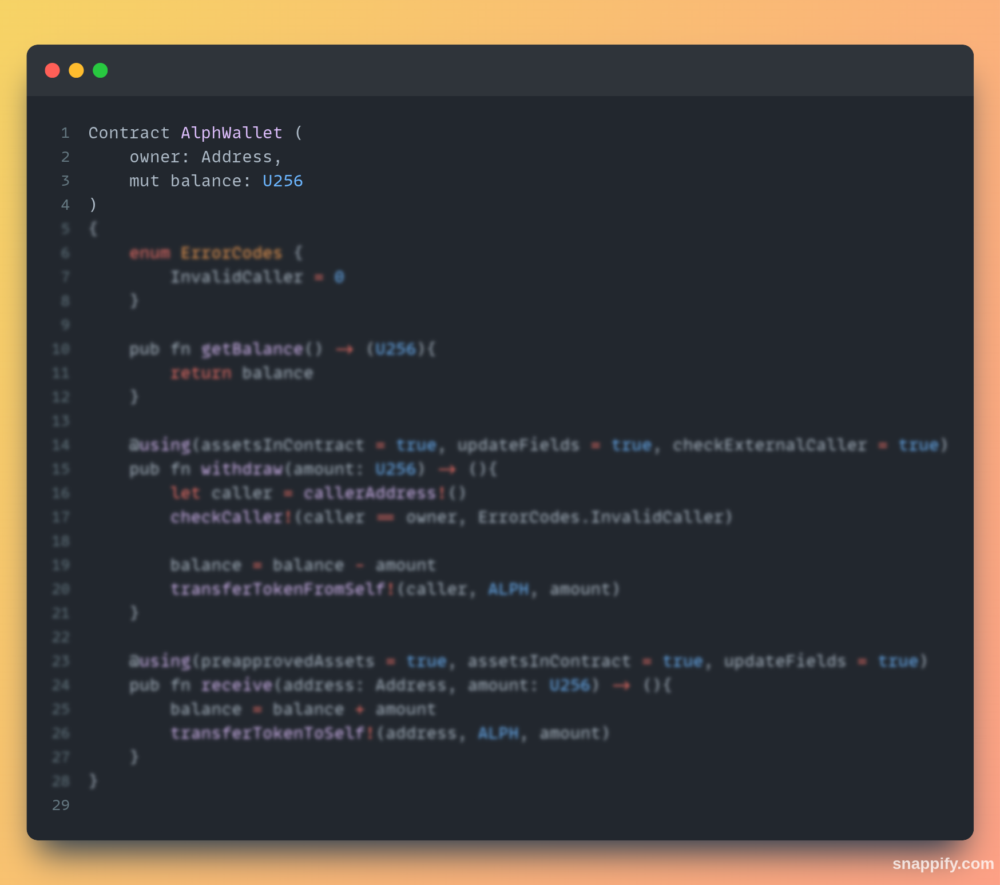
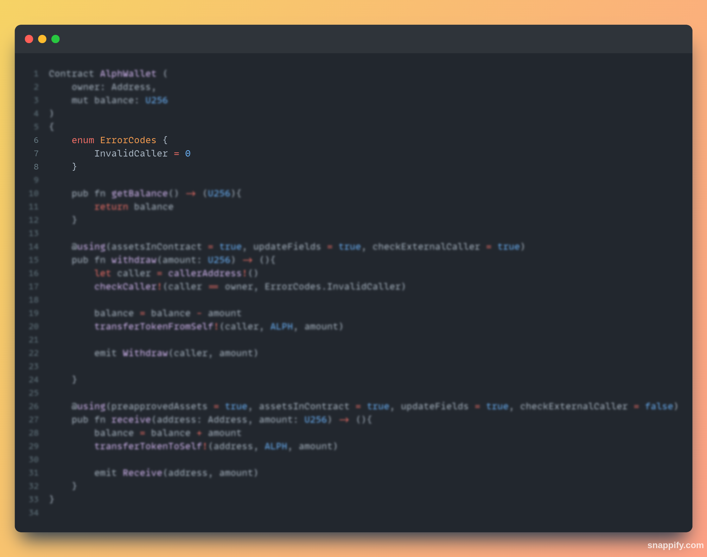
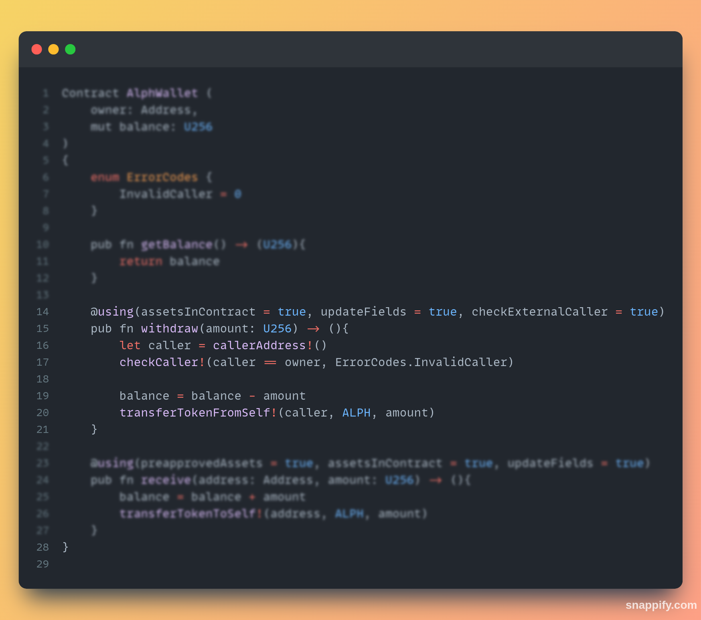

# AlphWallet

The goal of this is to explain and show the difference with simple and easy example from Solidity smart contract

We have encountered this [thread](https://twitter.com/0xNekr/status/1711766545959903526) from a talented Solidity developper, [0xNekr](https://twitter.com/0xNekr) and we are going to explain how to write the same code in Ralph

Structure:
* [AlphWallet Smart-contract](alphWallet/contracts/alphWallet.ral)
* [TxScript to withdraw](alphWallet/contracts/withdraw.ral)
* [TxScript to receive](alphWallet/contracts/withdraw.ral)

Sources used for this code:
* [Article link](https://explorations-blockchain.com/2023/10/06/conception-dun-contrat-wallet-un-contrat-pour-gerer-vos-ethers/)
* [Twitter thread](https://twitter.com/0xNekr/status/1711766545959903526)

## Solidity - Ralph
By using the X thread from @0xNekr we are going to rewrite EtherWallet which is a smart contract to simulate a wallet in Ralph, smart contract language developed by @Alephium.
Do not use this code in production

First we need to define contract fields (its state) who are the owner of the "wallet" and the balance. The balance will follow the actual number of $ALPH. We could use tokenRemaining!() but to limit gas fee it's better to have a variable to save the number of $ALPH we have

Then we need can start the smart contract but we have at first define the errors we could have. We only have InvalidCaller error, if someone else than the owner call withdraw() which will be explained later

getBalance() function is just a function that return the actual number of $ALPH we have in the wallet

This is where the things become interesting. @Alephium using annotation to add an overall security of the assets (ALPH or other tokens) 
assetsInContract to be able to use the assets, ALPH in this case
updateFields because we are updating the contract state field balance
checkExternalCaller we need to check that only the owner can withdraw

Receive function enable the owner of the wallet to receive some $ALPH. In this case annotation is used too but we don't check the caller since anybody can send $ALPH to this address

